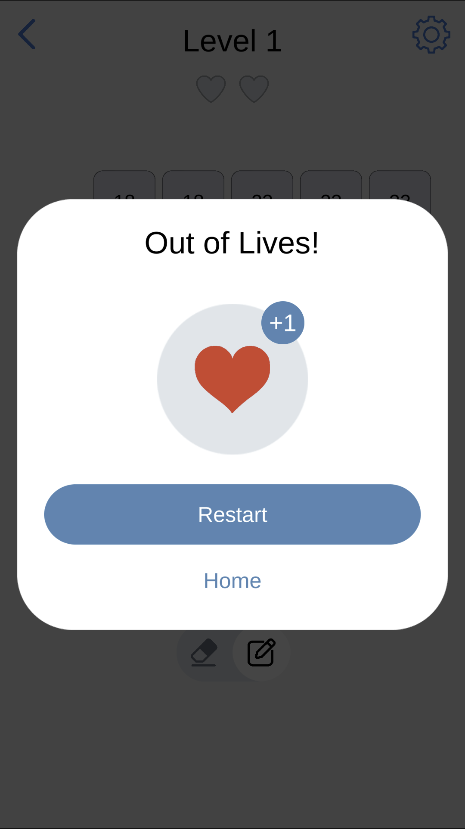

Sum of Numbers

Sum of Numbers is a Unity project that recreates the relaxing and challenging number-puzzle experience.  

Gameplay  
	•	Combine numbers on the grid to reach target sums.  
	•	Progress through increasingly challenging levels with strategic number placements.  
	•	Simple rules, but plenty of room for thoughtful moves and optimization.  

Tech Details  
	•	Built with Unity (C#).  
	•	Supports both desktop and mobile builds.  
	•	Clean, modular codebase for easy extension and customization.  

Features  
	•	Grid-based puzzle mechanics.  
	•	Smooth animations and transitions.  
	•	Expandable design for adding new puzzle types or variations.  

 Used Packages:  
 	•	Zenject: https://github.com/modesttree/Zenject  
  	•	UniTask: https://github.com/Cysharp/UniTask  
	•	DOTween: https://assetstore.unity.com/packages/tools/animation/dotween-hotween-v2-27676?srsltid=AfmBOoqJoZKgkXrtm3a3vj0pSnG-WOMHMKFvweY2sL2Aqsk9dpOxPANH  
	•	Naughty Attributes: https://assetstore.unity.com/packages/tools/utilities/naughtyattributes-129996?srsltid=AfmBOopXTIp01Vum6yJiheNkn5pI6vpFVJsXCTld9RhOU-yD3NdRJ7EF  
	•	Custom Object Pool written by me: https://github.com/roadsidepicnc/Custom-Object-Pooling-System-Using-Zenject  

